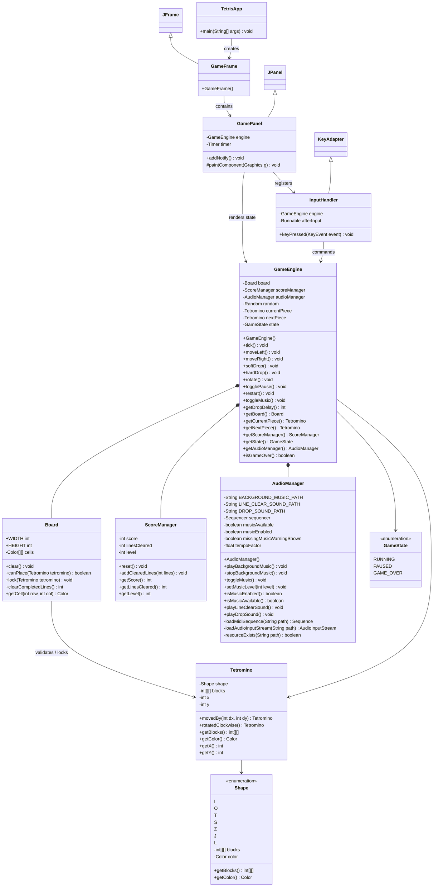
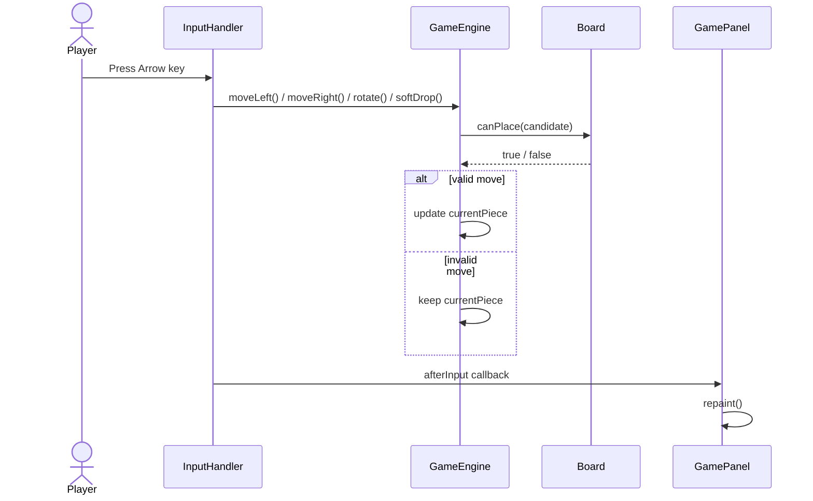
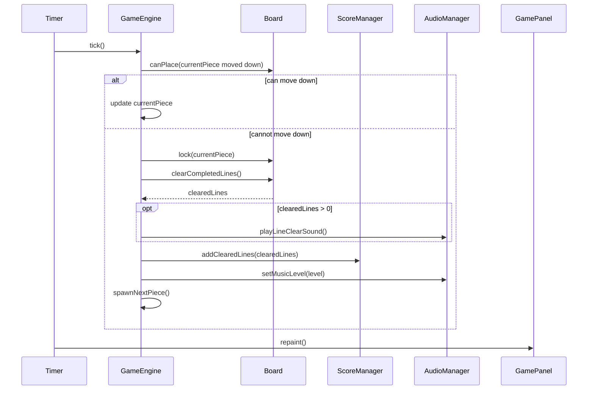
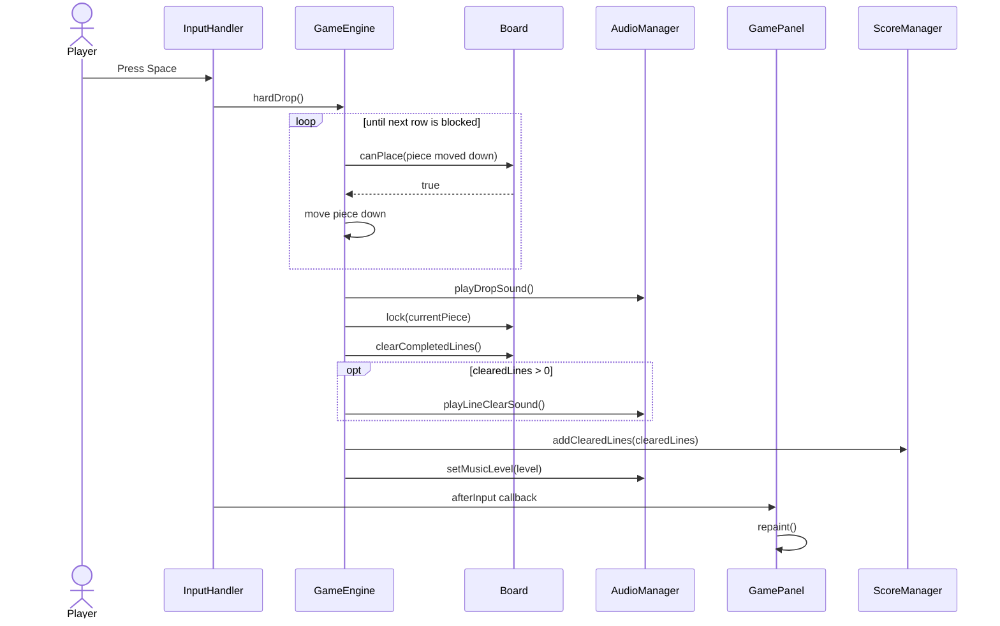
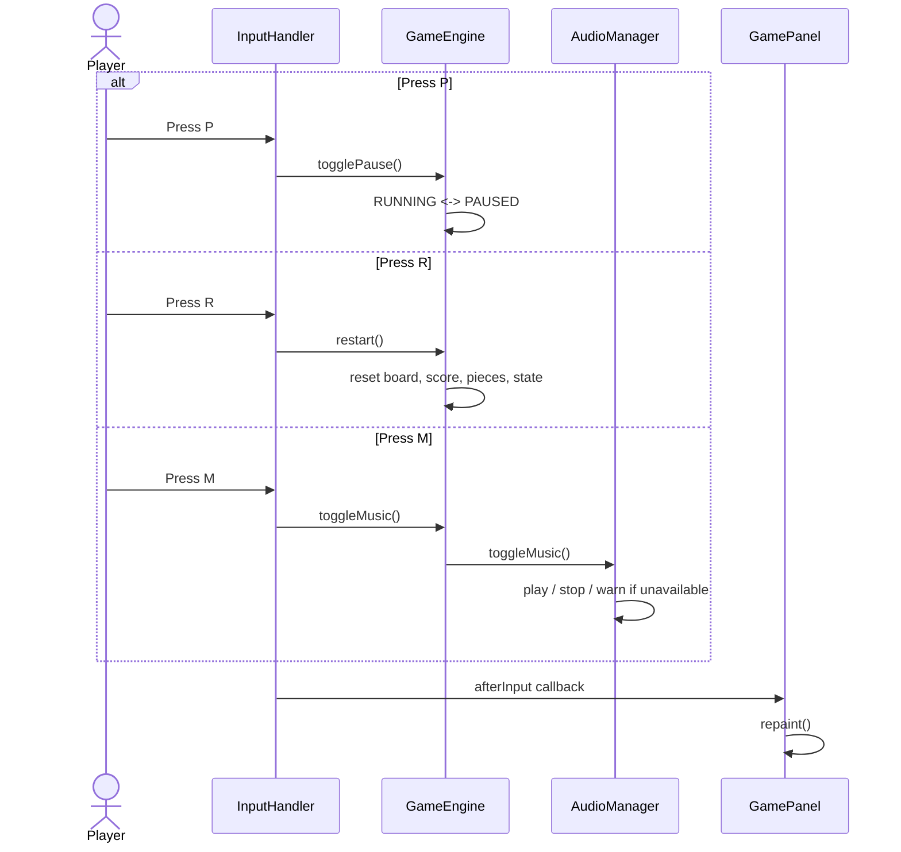

# UML Class Design

這份文件使用 Mermaid class diagram 描述目前 Version 3 的 class 關係。若在 GitHub 或支援 Mermaid 的 VS Code Markdown preview 中開啟，下面區塊會被渲染成 UML 圖。

## Mermaid Diagram

## Class Responsibilities

`TetrisApp`：程式進入點，負責在 Swing Event Dispatch Thread 建立 `GameFrame`。

`GameFrame`：主視窗，負責設定標題、關閉行為、尺寸與放入 `GamePanel`。

`GamePanel`：畫面層，負責繪製棋盤、方塊、分數、等級、下一個方塊、音樂狀態、操作提示與 overlay。

`InputHandler`：輸入層，集中處理方向鍵、Space、P、R、M，並轉呼叫 `GameEngine`。

`GameEngine`：規則層，管理下落、移動、旋轉、hard drop、消行、分數、等級、狀態切換與音訊操作入口。

`AudioManager`：音訊層，負責 MIDI 背景音樂與未來 WAV 音效擴充點，並確保音檔缺失時遊戲不 crash。

`Board`：棋盤資料，保存固定方塊、判斷碰撞、清除完整行。

`Tetromino`：目前方塊的形狀、位置與旋轉後 block 座標。

`Shape`：七種 Tetromino 的初始 block 座標與顏色。

`GameState`：遊戲流程狀態，包含 `RUNNING`、`PAUSED`、`GAME_OVER`。

`ScoreManager`：分數、消行數與等級計算。

## Latest Version Notes

This diagram reflects the current audio-ready and runnable-jar version.

- `AudioManager` now supports MIDI background music, WAV sound effects, music tempo changes by level, and resource loading from either the jar/classpath or the local file system.
- `drop.wav` is played during `hardDrop()`.
- `clear.wav` is played only when `clearCompletedLines()` returns one or more cleared lines.
- `setMusicLevel()` is called after restart and after each piece lock so the MIDI tempo follows the current level.
- The runnable jar includes `assets/audio/katusha.mid`, `assets/audio/drop.wav`, and `assets/audio/clear.wav`.

## Use Case Diagram

Mermaid 沒有專用的 UML use case 語法，因此這裡用 flowchart 表示 actor 與 use case 的關係。

## Scenario Diagrams

以下 scenario 描述玩家操作如何流經 `InputHandler`、`GameEngine`、`AudioManager` 與 `GamePanel`。

### Scenario 1：Move Or Rotate Piece

### Scenario 2：Timer Tick And Line Clear

### Scenario 3：Hard Drop

### Scenario 4：Pause, Restart, And Music Toggle

