# UML Class Design

這份文件使用 Mermaid class diagram 描述目前 Version 3 的 class 關係。若在 GitHub 或支援 Mermaid 的 VS Code Markdown preview 中開啟，下面區塊會被渲染成 UML 圖。

## Mermaid Diagram

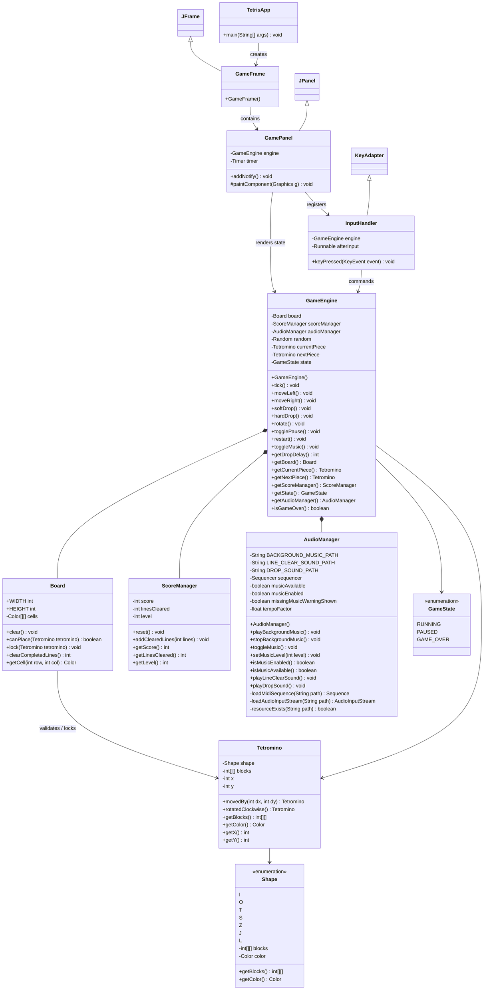

## Class Responsibilities

`TetrisApp`：程式進入點，負責在 Swing Event Dispatch Thread 建立 `GameFrame`。

`GameFrame`：主視窗，負責設定標題、關閉行為、尺寸與放入 `GamePanel`。

`GamePanel`：畫面層，負責繪製棋盤、方塊、分數、等級、下一個方塊、音樂狀態、操作提示與 overlay。

`InputHandler`：輸入層，集中處理方向鍵、Space、P、R、M，並轉呼叫 `GameEngine`。

`GameEngine`：規則層，管理下落、移動、旋轉、hard drop、消行、分數、等級、狀態切換與音訊操作入口。

`AudioManager`：音訊層，負責 MIDI 背景音樂與未來 WAV 音效擴充點，並確保音檔缺失時遊戲不 crash。

`Board`：棋盤資料，保存固定方塊、判斷碰撞、清除完整行。

`Tetromino`：目前方塊的形狀、位置與旋轉後 block 座標。

`Shape`：七種 Tetromino 的初始 block 座標與顏色。

`GameState`：遊戲流程狀態，包含 `RUNNING`、`PAUSED`、`GAME_OVER`。

`ScoreManager`：分數、消行數與等級計算。

## Latest Version Notes

This diagram reflects the current audio-ready and runnable-jar version.

- `AudioManager` now supports MIDI background music, WAV sound effects, music tempo changes by level, and resource loading from either the jar/classpath or the local file system.
- `drop.wav` is played during `hardDrop()`.
- `clear.wav` is played only when `clearCompletedLines()` returns one or more cleared lines.
- `setMusicLevel()` is called after restart and after each piece lock so the MIDI tempo follows the current level.
- The runnable jar includes `assets/audio/katusha.mid`, `assets/audio/drop.wav`, and `assets/audio/clear.wav`.

## Use Case Diagram

Mermaid 沒有專用的 UML use case 語法，因此這裡用 flowchart 表示 actor 與 use case 的關係。

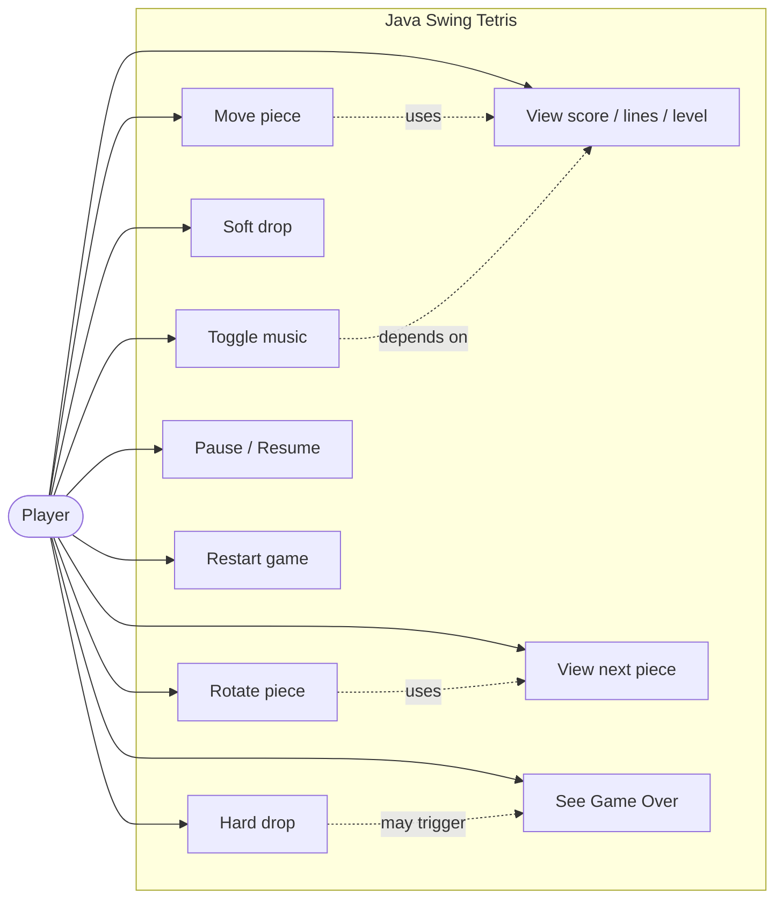

## Scenario Diagrams

以下 scenario 依事件分組。每個 scenario 都只描述該流程需要的參與者與模組；目前版本沒有 title screen，也沒有 shoot 動作，遊戲啟動後會直接進入 `RUNNING` 狀態。

### Scenario 1：Start Game

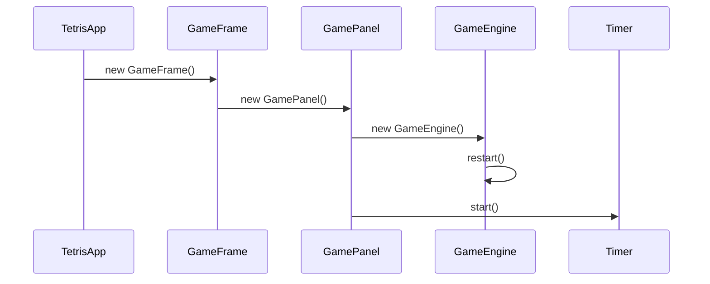

| Step | Player | TetrisApp | GameFrame | GamePanel | GameEngine | Timer |
|---|---|---|---|---|---|---|
| 1 | Launches app | `main()` schedules UI |  |  |  |  |
| 2 |  | Creates frame | Constructor runs |  |  |  |
| 3 |  |  | Adds panel | Constructor runs | Creates engine |  |
| 4 |  |  |  |  | `restart()` initializes board, score, pieces, state |  |
| 5 |  |  | `setVisible(true)` | Starts repaint loop |  | `start()` |

1. Player launches the application.
2. `TetrisApp.main()` creates `GameFrame` on the Swing Event Dispatch Thread.
3. `GameFrame` adds a new `GamePanel`.
4. `GamePanel` creates `GameEngine`; the engine constructor calls `restart()`.
5. `GamePanel` starts the Swing `Timer`, so the game begins in `RUNNING`.

### Scenario 2：Move Or Rotate Piece

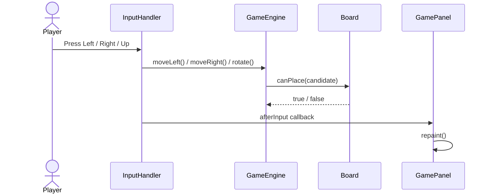

| Step | Player | InputHandler | GameEngine | Board | GamePanel |
|---|---|---|---|---|---|
| 1 | Presses Left, Right, or Up | Receives `keyPressed()` |  |  |  |
| 2 |  | Calls `moveLeft()`, `moveRight()`, or `rotate()` | Builds candidate piece |  |  |
| 3 |  |  | Calls `canPlace(candidate)` | Returns valid or blocked |  |
| 4 |  |  | Updates `currentPiece` only when valid |  |  |
| 5 |  | Runs callback |  |  | Updates timer delay and repaints |

1. Player presses Left, Right, or Up.
2. `InputHandler.keyPressed()` maps the key to `GameEngine.moveLeft()`, `moveRight()`, or `rotate()`.
3. `GameEngine.tryMove()` asks `Board.canPlace(candidate)`.
4. If the candidate is valid and the state is `RUNNING`, `currentPiece` changes.
5. `InputHandler` runs the callback so `GamePanel` updates the timer delay and repaints.

### Scenario 3：Soft Drop

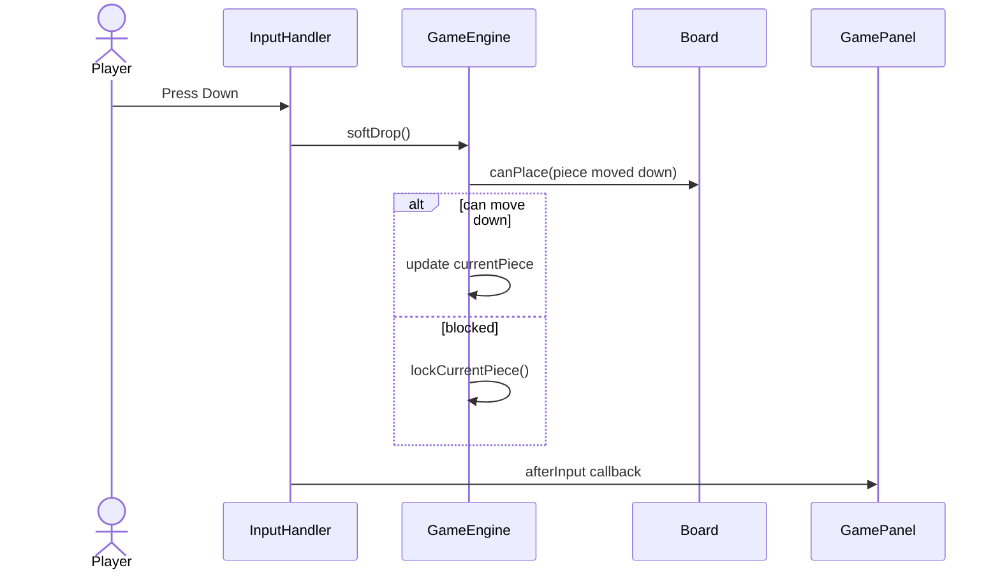

| Step | Player | InputHandler | GameEngine | Board | GamePanel |
|---|---|---|---|---|---|
| 1 | Presses Down | Receives `keyPressed()` |  |  |  |
| 2 |  | Calls `softDrop()` | Checks `RUNNING` state |  |  |
| 3 |  |  | Calls `movePieceDownOrLock()` | `canPlace(moved)` |  |
| 4 |  |  | Moves piece or locks it | May receive locked cells later |  |
| 5 |  | Runs callback |  |  | Updates timer delay and repaints |

1. Player presses Down.
2. `InputHandler` calls `GameEngine.softDrop()`.
3. `softDrop()` only acts when state is `RUNNING`.
4. The engine tries to move the piece one row down.
5. If the piece is blocked, the engine locks it through the normal lock flow.
6. `GamePanel` repaints after the input callback.

### Scenario 4：Hard Drop And Lock Piece

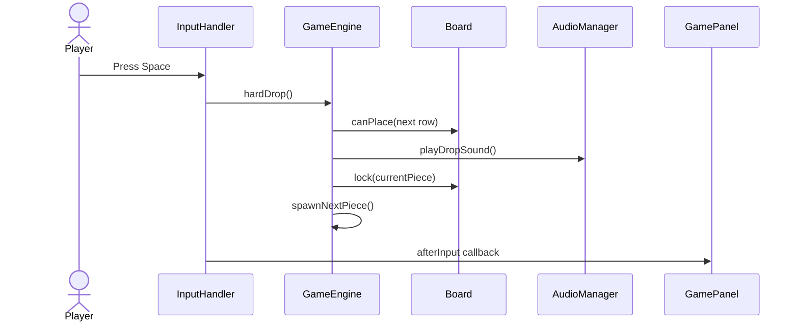

| Step | Player | InputHandler | GameEngine | Board | AudioManager | GamePanel |
|---|---|---|---|---|---|---|
| 1 | Presses Space | Receives `keyPressed()` |  |  |  |  |
| 2 |  | Calls `hardDrop()` | Checks `RUNNING` state |  |  |  |
| 3 |  |  | Repeats downward candidate checks | `canPlace(next row)` |  |  |
| 4 |  |  | Sets final dropped position |  | `playDropSound()` |  |
| 5 |  |  | Locks piece and spawns next | `lock(currentPiece)` |  |  |
| 6 |  | Runs callback |  |  |  | Updates timer delay and repaints |

1. Player presses Space.
2. `InputHandler` calls `GameEngine.hardDrop()`.
3. The engine moves the piece downward until `Board.canPlace(dropped.movedBy(0, 1))` is false.
4. The engine plays the drop sound through `AudioManager.playDropSound()`.
5. The engine locks the piece, checks line clears, and spawns the next piece.
6. `GamePanel` repaints after the input callback.

### Scenario 5：Timer Tick And Falling Piece

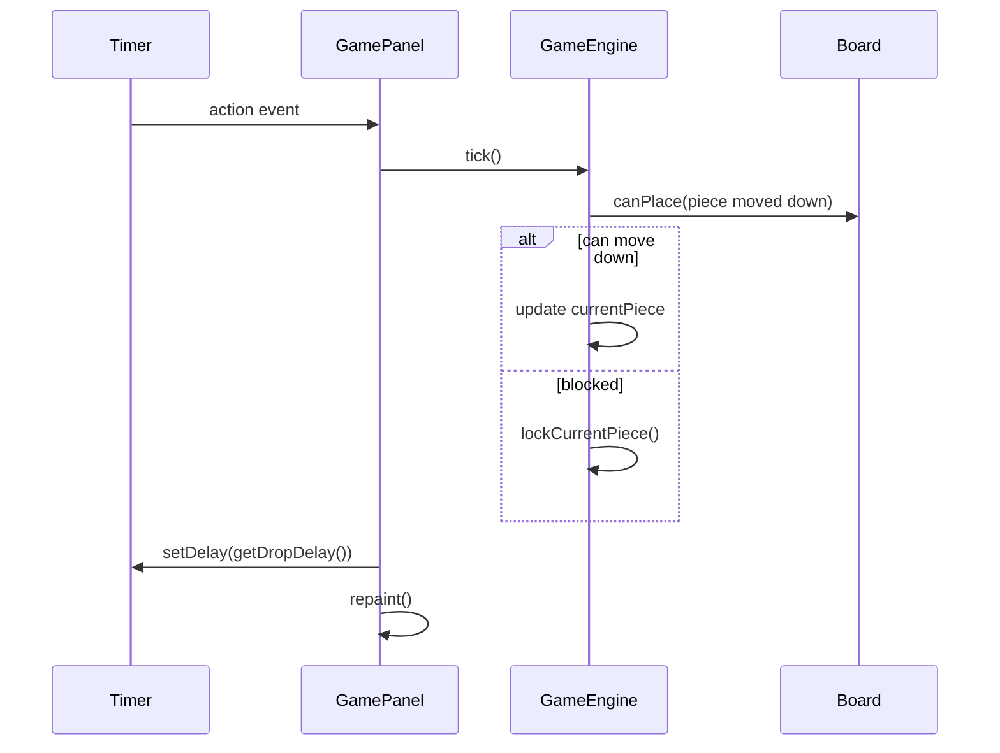

| Step | Timer | GamePanel | GameEngine | Board |
|---|---|---|---|---|
| 1 | Fires action event | Timer callback runs |  |  |
| 2 |  | Calls `tick()` | Returns immediately unless state is `RUNNING` |  |
| 3 |  |  | Calls `movePieceDownOrLock()` | `canPlace(moved)` |
| 4 |  |  | Moves or locks current piece |  |
| 5 | Receives new delay | Calls `setDelay(engine.getDropDelay())` and `repaint()` |  |  |

1. Swing `Timer` fires.
2. `GamePanel` calls `GameEngine.tick()`.
3. If state is not `RUNNING`, `tick()` returns.
4. If the piece can move down, `currentPiece` moves by one row.
5. If blocked, the engine locks the piece.
6. The timer delay is refreshed from `GameEngine.getDropDelay()`, then the panel repaints.

### Scenario 6：Clear Lines And Advance Level

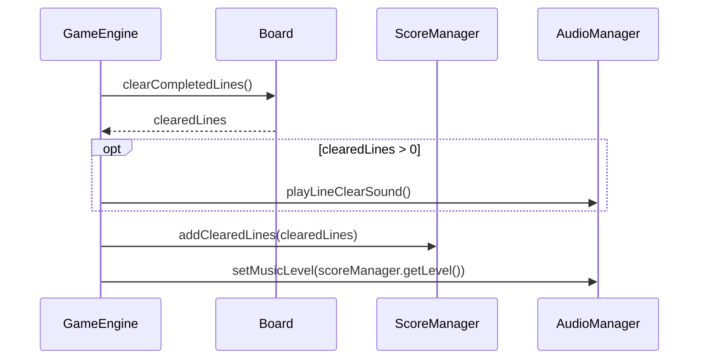

| Step | GameEngine | Board | ScoreManager | AudioManager |
|---|---|---|---|---|
| 1 | Runs `lockCurrentPiece()` |  |  |  |
| 2 | Calls `clearCompletedLines()` | Removes full rows |  |  |
| 3 | Receives `clearedLines` |  |  |  |
| 4 | If lines were cleared |  |  | `playLineClearSound()` |
| 5 | Sends cleared count |  | `addClearedLines(clearedLines)` updates score and level |  |
| 6 | Applies current level |  |  | `setMusicLevel(level)` |

1. A piece has just been locked.
2. `GameEngine.lockCurrentPiece()` calls `Board.clearCompletedLines()`.
3. `Board` removes full rows and returns the number of cleared lines.
4. If at least one line was cleared, `AudioManager.playLineClearSound()` runs.
5. `ScoreManager.addClearedLines()` updates total lines, score, and level.
6. `AudioManager.setMusicLevel()` adjusts MIDI tempo for the current level.

### Scenario 7：Pause And Resume

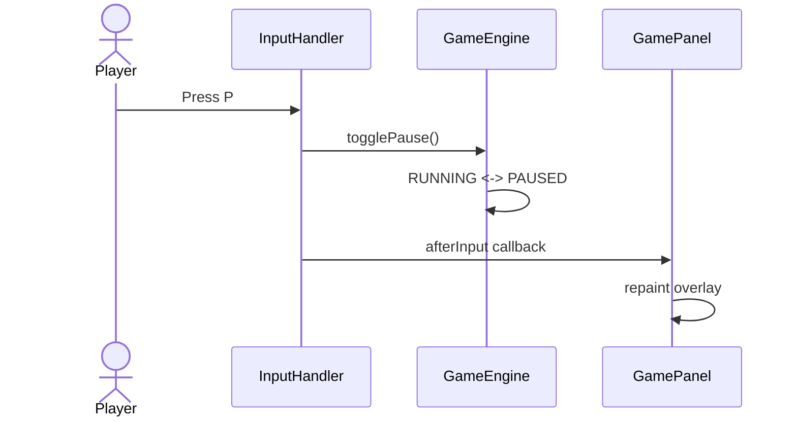

| Step | Player | InputHandler | GameEngine | GamePanel |
|---|---|---|---|---|
| 1 | Presses P | Receives `keyPressed()` |  |  |
| 2 |  | Calls `togglePause()` | Switches `RUNNING` to `PAUSED`, or `PAUSED` to `RUNNING` |  |
| 3 |  | Runs callback |  | Updates timer delay and repaints |
| 4 |  |  |  | Shows or hides pause overlay |

1. Player presses P.
2. `InputHandler` calls `GameEngine.togglePause()`.
3. The engine changes `RUNNING` to `PAUSED`, or `PAUSED` back to `RUNNING`.
4. `GamePanel` repaints and displays the pause overlay only while state is `PAUSED`.

### Scenario 8：Toggle Music

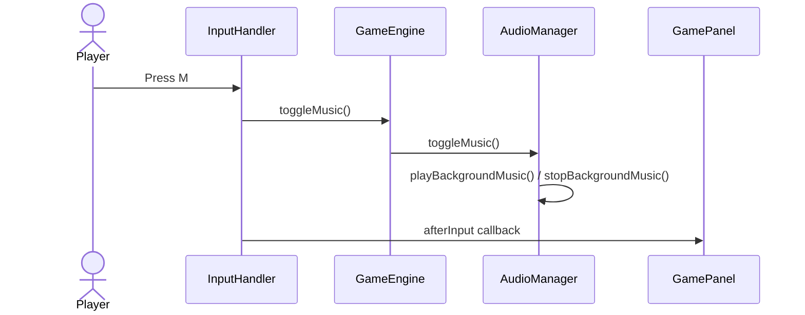

| Step | Player | InputHandler | GameEngine | AudioManager | GamePanel |
|---|---|---|---|---|---|
| 1 | Presses M | Receives `keyPressed()` |  |  |  |
| 2 |  | Calls `toggleMusic()` | Delegates to audio manager |  |  |
| 3 |  |  |  | Starts or stops MIDI music |  |
| 4 |  | Runs callback |  |  | Repaints music status |

1. Player presses M.
2. `InputHandler` calls `GameEngine.toggleMusic()`.
3. `GameEngine` delegates to `AudioManager.toggleMusic()`.
4. `AudioManager` either calls `playBackgroundMusic()` or `stopBackgroundMusic()`.
5. `GamePanel` repaints the side panel music status.

### Scenario 9：Game Over And Restart

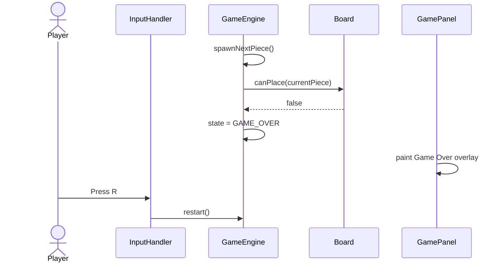

| Step | Player | InputHandler | GameEngine | Board | GamePanel |
|---|---|---|---|---|---|
| 1 |  |  | `spawnNextPiece()` |  |  |
| 2 |  |  | Checks new piece | `canPlace(currentPiece)` returns false |  |
| 3 |  |  | Sets state to `GAME_OVER` |  | Paints Game Over overlay |
| 4 | Presses R | Receives `keyPressed()` |  |  |  |
| 5 |  | Calls `restart()` | Clears board, score, pieces, state | Board is cleared |  |
| 6 |  | Runs callback |  |  | Repaints running game |

1. After a lock flow, `GameEngine.spawnNextPiece()` makes the queued piece current.
2. The engine asks `Board.canPlace(currentPiece)`.
3. If the new piece cannot be placed, state becomes `GAME_OVER`.
4. `GamePanel.paintComponent()` draws the Game Over overlay.
5. Player presses R.
6. `InputHandler` calls `GameEngine.restart()`.
7. The board, score, music level, pieces, and state are reset, then the panel repaints.
