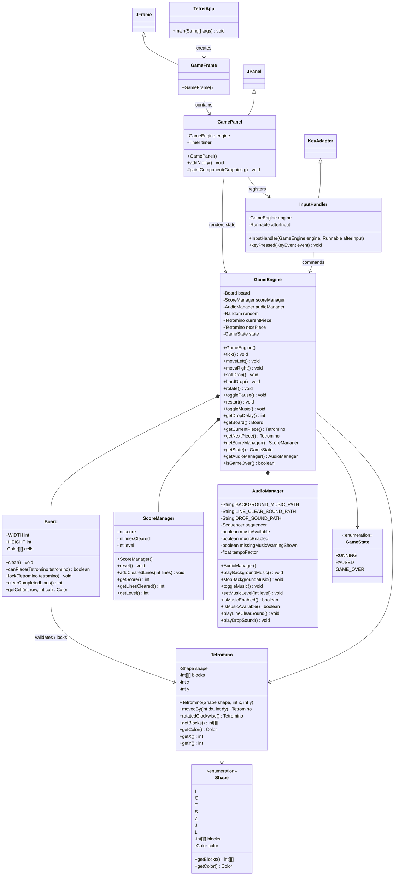
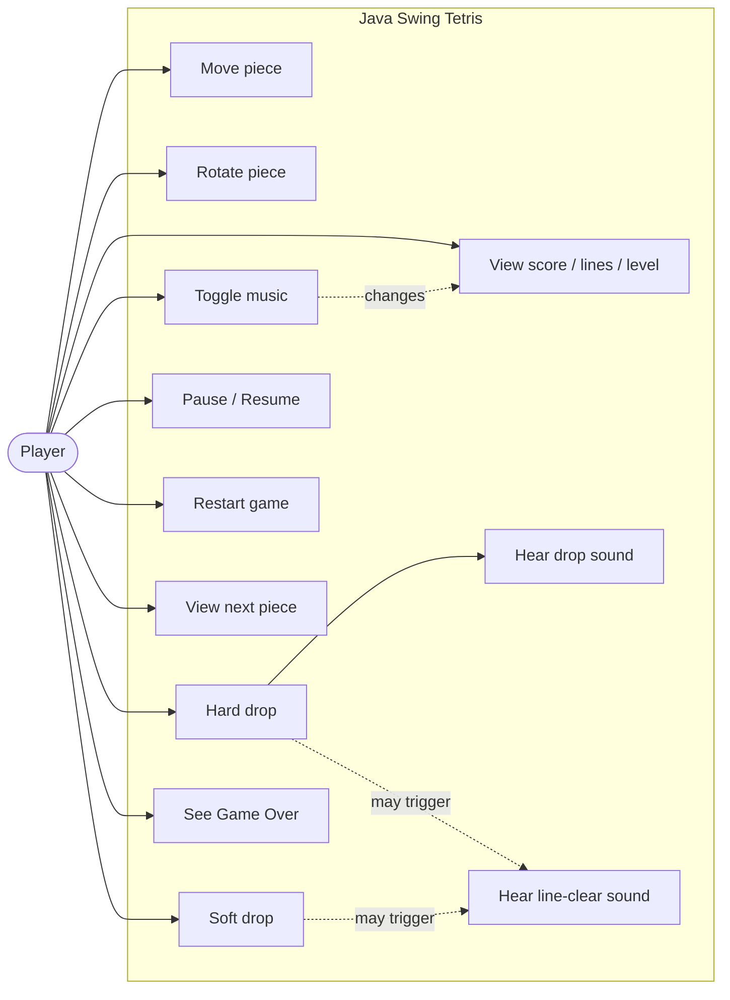
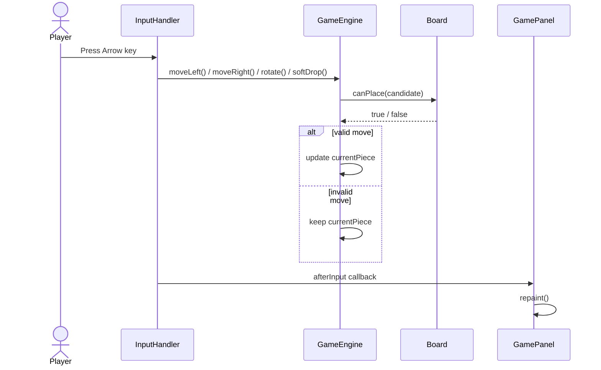
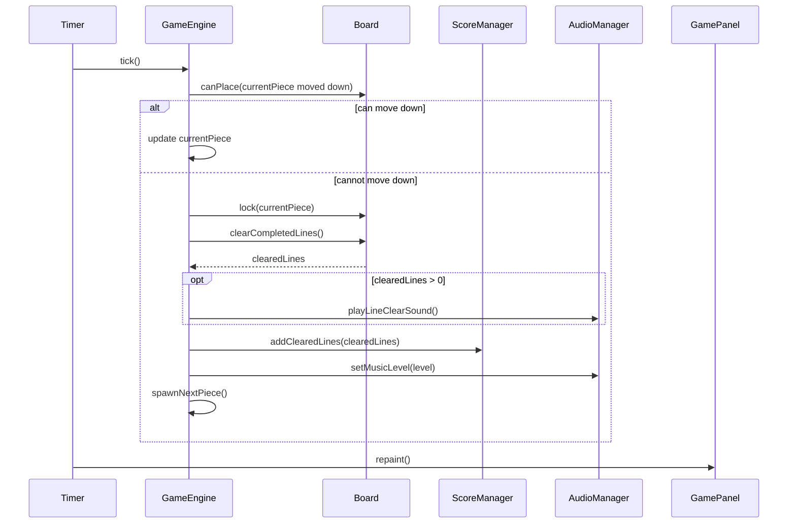
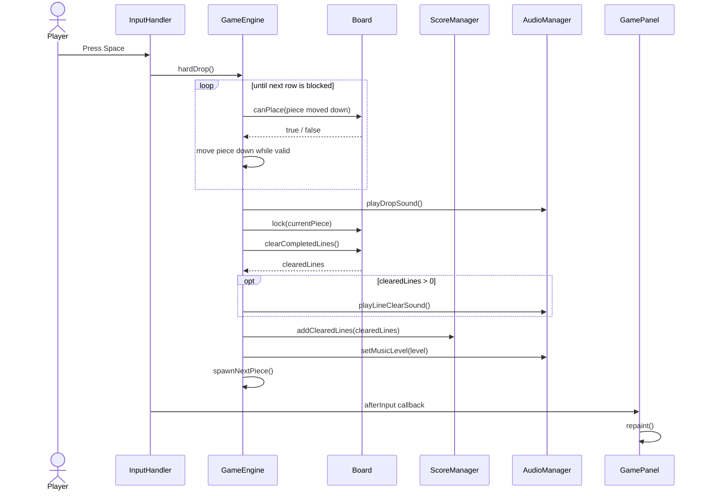
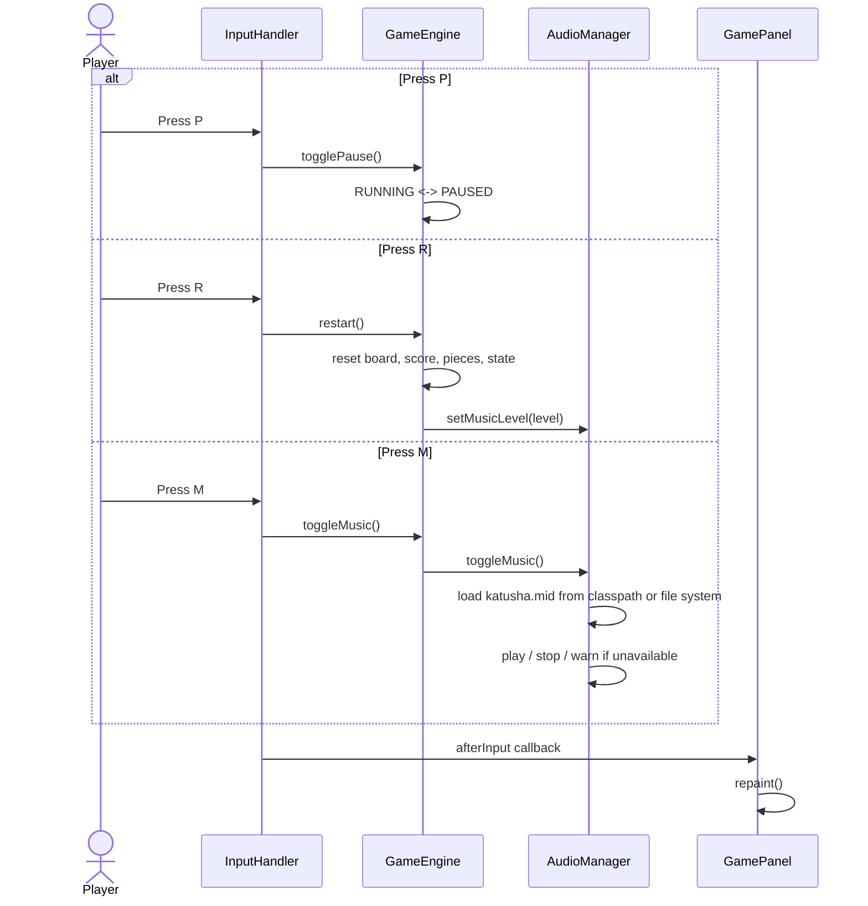
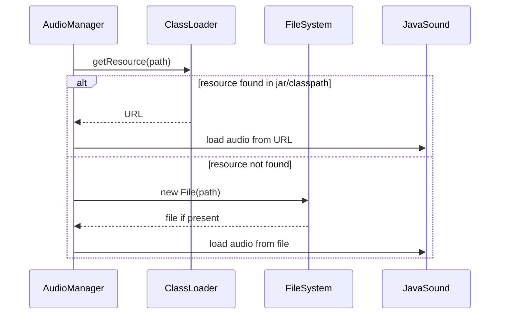

# UML Class Design

這份文件用 Mermaid 記錄 Java Swing Tetris 的主要 class、責任分工、玩家操作案例與關鍵流程。可以在 GitHub 或 VS Code Markdown Preview 中直接預覽圖表。

目前內容反映 runnable jar 與音訊素材已完成整合的版本：

- 背景音樂使用 `assets/audio/katusha.mid`。
- hard drop 使用 `assets/audio/drop.wav`。
- 消行音效使用 `assets/audio/clear.wav`。
- `AudioManager` 支援從 jar/classpath 或檔案系統載入音訊資源。
- `AudioManager.setMusicLevel()` 會依照等級調整 MIDI 播放速度。

## Mermaid Diagram

## Class Responsibilities

`TetrisApp`：程式進入點，透過 Swing Event Dispatch Thread 建立 `GameFrame`。

`GameFrame`：主視窗，設定標題、關閉行為、尺寸，並放入 `GamePanel`。

`GamePanel`：畫面層，負責繪製棋盤、目前方塊、下一個方塊、分數資訊、音樂狀態與 pause/game over overlay。它也持有 Swing `Timer`，定期呼叫 `GameEngine.tick()`。

`InputHandler`：鍵盤輸入層，把方向鍵、Space、P、R、M 轉成 `GameEngine` 的操作，操作後執行 `afterInput` callback 讓畫面更新。

`GameEngine`：遊戲規則核心，管理方塊移動、旋轉、soft drop、hard drop、鎖定、消行、分數、等級、暫停、重新開始與音訊觸發。

`AudioManager`：音訊層，負責 MIDI 背景音樂、WAV 音效、音樂速度調整，以及 jar/classpath 與檔案系統兩種資源載入模式。音檔不存在或格式不支援時只印出 warning，不讓遊戲 crash。

`Board`：棋盤資料結構，儲存已鎖定方塊，判斷方塊是否可放置，處理鎖定與消行。

`Tetromino`：目前方塊的不可變資料模型，包含形狀、座標與旋轉/位移後的新方塊。

`Shape`：七種方塊形狀與顏色定義。

`GameState`：遊戲狀態，包含 `RUNNING`、`PAUSED`、`GAME_OVER`。

`ScoreManager`：分數、消行數與等級計算。

## Design Notes

這個設計刻意讓 UI、規則與音訊分層：

- `GamePanel` 不直接修改棋盤規則，只讀取 `GameEngine` 狀態並繪圖。
- `InputHandler` 不知道消行或分數細節，只把按鍵轉成 engine command。
- `GameEngine` 是唯一知道「何時 hard drop、何時消行、何時更新等級」的核心。
- `AudioManager` 不知道遊戲規則，只提供播放音樂、播放音效與調整音樂速度的能力。

這樣做的好處是教學時可以清楚追蹤資料流：輸入進入 `InputHandler`，規則集中在 `GameEngine`，畫面由 `GamePanel` 根據狀態重畫，音訊由 `AudioManager` 專責處理。

## Use Case Diagram

Mermaid 沒有專用的 UML use case 語法，因此這裡用 flowchart 表示 actor 與 use case 的關係。

## Scenario Diagrams

以下 scenario 描述玩家操作如何流經 `InputHandler`、`GameEngine`、`Board`、`ScoreManager`、`AudioManager` 與 `GamePanel`。

### Scenario 1: Move Or Rotate Piece

### Scenario 2: Timer Tick And Line Clear

### Scenario 3: Hard Drop

### Scenario 4: Pause, Restart, And Music Toggle

## Resource Loading Sequence

Runnable jar 版本的關鍵是音檔不一定是一般檔案。`AudioManager` 會先嘗試從 classpath 找資源，再回退到檔案系統。

